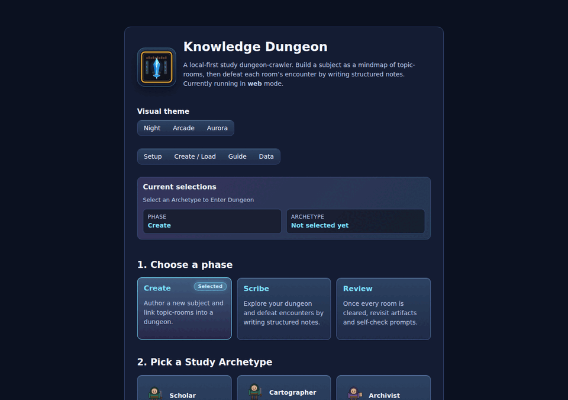
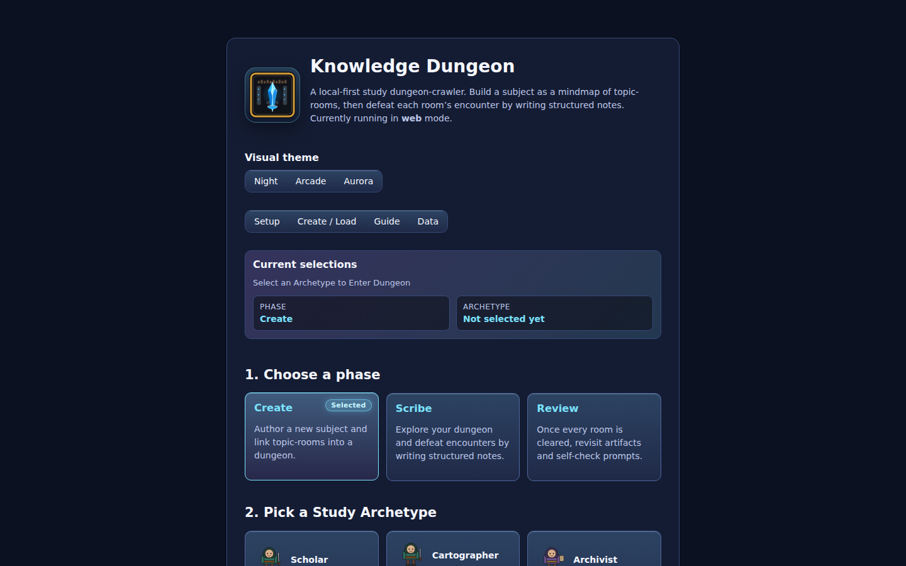
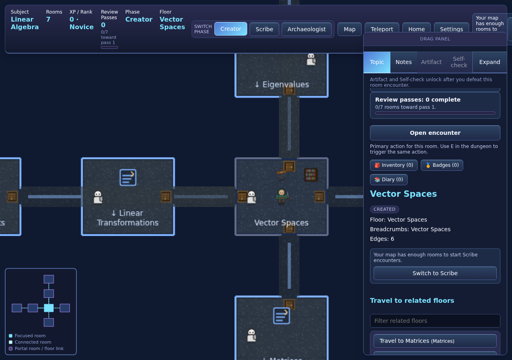

# Knowledge Dungeon

A local-first, offline-friendly **study dungeon-crawler** built on the
[`repo-dungeon`](https://github.com/McFuzzySquirrel/repo-dungeon) engine,
fed by the **mindmap-driven learning concept** from
[`mindmap-dungeon`](https://github.com/McFuzzySquirrel/mindmap-dungeon).

You author a *subject* as a mindmap of topic-rooms, then walk into each room
and defeat its encounter by writing structured notes that pass deterministic
quality gates. Defeated rooms drop loot, XP, and a generated artifact. When
every room is cleared, the **Archaeologist** phase unlocks self-check prompts
and review-streak tracking.

Built with a simple goal: make learning feel fun again by turning note-taking,
revision, and concept mapping into an interactive adventure instead of a static checklist.

## Why Use This

Knowledge Dungeon is useful anywhere mindmaps and notes intersect with real learning.

- **Students**: turn class topics into rooms, write concise study notes, and use Recall Questions for active memory practice.
- **Developers**: map your codebase architecture into connected topics, then explore system boundaries, dependencies, and workflows as a playable graph.
- **Researchers / knowledge workers**: break complex subjects into linked rooms and keep concept notes connected instead of isolated.
- **Teams**: create shared onboarding dungeons so newcomers can learn architecture, conventions, and workflows in a structured path.
- **Anyone who uses mindmaps + notes**: keep the visual map and written understanding synchronized, with a loop that encourages review rather than passive storage.

### Explore Your Repository As A Mindmap

You can generate a Knowledge Dungeon subject directly from a repository and explore it like an interactive architecture map:

1. Generate a repo subject with the portable Copilot skill (see link below).
2. Load/refresh it in Knowledge Dungeon.
3. Traverse rooms to understand modules, runtime flow, data boundaries, and tooling relationships.

This works especially well for onboarding, architecture reviews, and "what does this codebase actually do?" sessions.

## Screenshots



### Home / subject management



The home screen is where you:

- choose the current phase and study archetype
- create a new subject from a root topic
- browse previously created subjects by **name** and room count
- refresh the local subject list before jumping back in
- access desktop-only admin/export helpers from the Admin section

### In-dungeon study view



Once a subject is loaded, the in-dungeon view keeps the study loop visible in one place:

- HUD for phase, progression, current floor, map, home, and help
- room-panel **Collections** shortcuts for inventory, badges, and diary
- HUD teleport spell for floor/room jumps with cooldown tracking
- Phaser dungeon canvas for movement and room navigation
- minimap and room panel for topic context, breadcrumbs, portals, and creator edits
- the room panel splits travel options into **connected topics on this
  floor** and **travel to related floors** (with a one-click `← Back to <parent>`
  shortcut) so deep mindmaps stay navigable
- the full **Map** overlay (<kbd>M</kbd>) defaults to a per-floor view that
  greys out unrelated floors and renders the parent entry room as a dashed
  blue portal — toggle **Show current floor only** off to see the whole
  topic graph at once
- in the full map, drag empty space to pan and drag any room node to
  reposition it while its connections remain attached
- encounter notes accept lightweight Markdown (links, bold, italic, code,
  bullets) with a live Edit/Preview toggle
- encounters that do not yet meet all validation checks can be safely stored
  with **Save draft**, so learners can continue iterating without losing work
- in the Scribe phase, the Notes tab can attach local/URL images per room;
  each image card includes an **Insert in note** action so learners can place
  visuals without typing markdown tokens manually
- room panel includes an **Expand/Collapse** toggle for a larger note + image
  workspace during media-heavy study sessions
- during the **Archaeologist** phase, every room that has produced an
  artifact is marked with a loot-chest icon on the dungeon canvas so
  cleared topics are easy to revisit
- diary entries for collected notes are clickable and open the full
  artifact note, so review runs can use the journal as a recall index

### Inventory, Badges, And Diary

Knowledge Dungeon includes a small progression loop that rewards study quality and keeps review material easy to find.

- **Inventory (🎒)**: when you defeat encounters, generated artifacts are collected as loot entries. This gives each cleared topic a tangible output you can revisit.
- **Badges (🏅)**: milestone achievements are awarded for learning behaviors (for example, writing more complete notes). Badges make progress visible beyond raw XP.
- **Diary (📚)**: collected note entries are stored in a browsable journal; selecting an entry opens the full note so you can quickly review what you previously wrote.

These three views are available from the room-panel **Collections** shortcuts and are designed to support both motivation (rewarding progress) and retention (fast recall).

## Tech stack

- React 19, Phaser 3, Zustand
- Vite 8, TypeScript 5
- Electron 42 (desktop), electron-builder for mac / win / linux
- Vitest + Testing Library for unit tests
- ESLint 9 (flat config)

## The three phases

| Phase | Mode | What you do |
| ----- | ---- | ----------- |
| **Creator** | Architect | Author the dungeon by bulk-adding topic-rooms, reparenting them, and editing the mindmap. |
| **Scribe** | Explore | Walk into rooms and submit notes that pass the validation rubric. |
| **Archaeologist** | Review & Consolidate | Once every room is cleared, revisit artifacts and self-check prompts. |

## Getting started

```bash
npm install
npm run dev               # web dev server
npm run electron          # web build + Electron shell
```

Other useful scripts:

```bash
npm run lint
npm run typecheck
npm run test              # vitest --run
npm run build:web         # production web bundle
npm run check:bundle-size # bundle-size guard used in CI
npm run package:electron  # local Electron package (no signing)
```

## Building an Electron install package

The commands below produce a distributable installer in the `release/` folder.

**Prerequisites**

- `npm install` already run
- On **macOS**, code-signing requires an Apple Developer certificate in your
  Keychain; without one, omit `--mac dmg` targets or set
  `CSC_IDENTITY_AUTO_DISCOVERY=false`.
- On **Windows** (cross-compilation from another OS is not supported by
  NSIS), signing requires a `CSC_LINK` / `CSC_KEY_PASSWORD` code-signing
  certificate; unsigned builds work without those env vars.

**Platform-specific commands**

| Target | Command |
|--------|---------|
| Current platform only (unpacked, no installer — fast for testing) | `npm run package:electron` |
| macOS `.dmg` + `.zip` | `npm run package:electron:mac` |
| Windows NSIS installer + `.zip` | `npm run package:electron:win` |
| Linux `.AppImage` + `.deb` | `npm run package:electron:linux` |
| All three platforms at once | `npm run package:electron:full` |

**Step-by-step (example: macOS)**

```bash
# 1. Install dependencies
npm install

# 2. Build web assets and the Electron main process
npm run build:electron

# 3. Package into a distributable (output goes to release/)
npm run package:electron:mac
```

The finished installer appears under `release/` as
`Knowledge Dungeon-<version>-mac-<arch>.dmg` (and a `.zip` companion).
Open the `.dmg`, drag the app to `/Applications`, and launch it normally.

> **Linux `.deb` only** (no `.AppImage`): replace step 3 with
> `npm run package:electron:linux`.
> **Linux `.AppImage` only**: use `npm run package:electron:linux:appimage`.

## Controls

| Action | Keyboard | Touch |
| ------ | -------- | ----- |
| Move   | `W A S D` / arrows | On-screen D-pad |
| Interact (open encounter / mark reviewed) | `E` | `Interact` button |
| Toggle help | `?` | — |

## UI docs

- [UI walkthrough with screenshots](./docs/UI.md)
- [Customization: adding images, where subjects are saved, and desktop export helpers](./docs/CUSTOMIZATION.md)
- [Create-repo-mindmap skill usage](./SKILL.md)
- [Portable Copilot skill (copy/paste template)](./docs/COPILOT_SKILL_CREATE_REPO_MINDMAP.md)

## Project structure

```
src/
  core/                  # ported mindmap-dungeon domain
    graph/               # subject graph CRUD + revalidation
    validation/notes/    # deterministic note validation
    validation/persistence/ # shared domain types
    progression/         # XP/rank/badge engine
    artifacts/           # markdown artifact generator
    review/              # archaeologist phase logic
  game/                  # Phaser scenes + systems
  store/                 # Zustand stores (session, subject, progression)
  services/persistence/  # localStorage + Electron bridge
  electron/              # main + preload (Electron only)
  ui/                    # React shell: welcome, HUD, room panel, modals
tests/unit/              # Vitest unit tests
docs/                    # PRD + progress notes
```

## Persistence

- **Electron**: subjects are written to
  `<userData>/dungeon-data/<subject-id>/dungeon.json`, with timestamped
  backups under `.backups/`. The home-screen **Admin** section can open the
  subjects root or export either the full subjects directory or an individual
  subject folder for migration between machines.
- **Web**: subjects fall back to `localStorage`; import/export is supported
  via the persistence facade.

## Why this exists

`repo-dungeon` had great gameplay but its content provider (GitHub
repositories) was the wrong fit for studying.
`mindmap-dungeon` had the right learning loop but the wrong tech stack for
the maintainer&rsquo;s preferences. Knowledge Dungeon keeps **repo-dungeon&rsquo;s
engine and shell** verbatim and swaps its content provider for
**mindmap-dungeon&rsquo;s subject-graph domain model**.

## License

MIT — see [`LICENSE`](./LICENSE).
