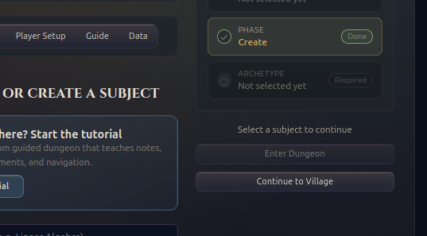
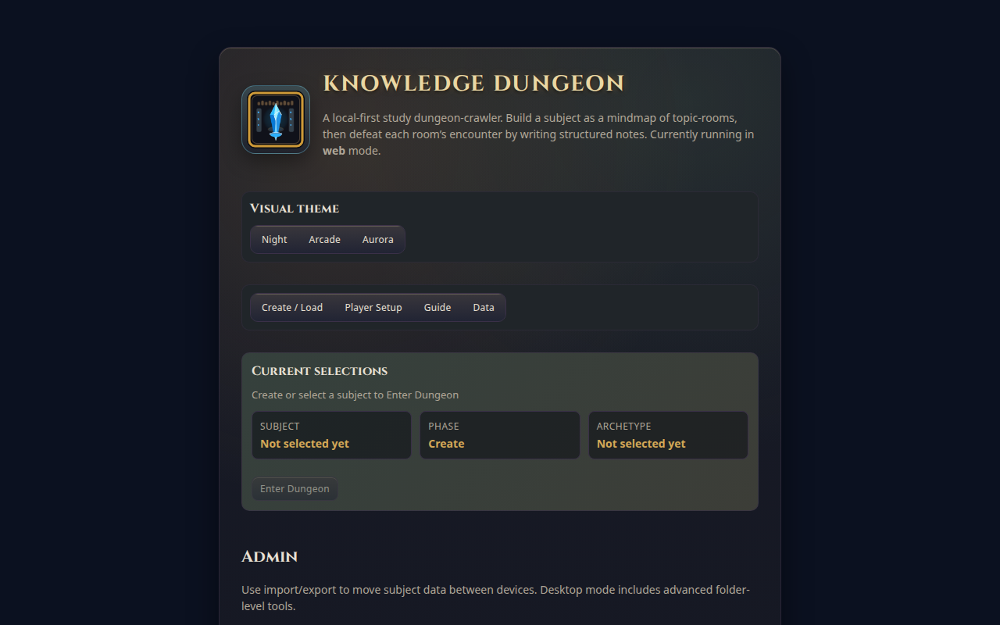

# Knowledge Dungeon

[](https://mcfuzzysquirrel.github.io/knowledge-dungeon/)

A local-first, offline-friendly **study dungeon-crawler** built on the
[`repo-dungeon`](https://github.com/McFuzzySquirrel/repo-dungeon) engine,
fed by the **mindmap-driven learning concept** from
[`mindmap-dungeon`](https://github.com/McFuzzySquirrel/mindmap-dungeon).

You author a *subject* as a mindmap of topic-rooms, then walk into each room
and defeat its encounter by writing structured notes that pass deterministic
quality gates. Defeated rooms drop loot, XP, and a generated artifact. When
every room is cleared, the **Archaeologist** phase unlocks self-check prompts
and review-streak tracking.

Your journey begins in the **Dungeon Village** - a Phaser-rendered hub world
with buildings, NPCs, signposts, and portals. Create subjects, select your
archetype, meet the guide NPC, view your collections, and step through any
portal to enter a dungeon.

Built with a simple goal: make learning feel fun again by turning note-taking,
revision, and concept mapping into an interactive adventure instead of a static checklist.

## Phase 5 Features (new)

### ⚡ Performance Optimization
Large subjects (100+ rooms) now benefit from a spatial grid for O(1) room lookups instead of linear scanning. Includes FPS monitoring and localStorage usage tracking.

### ♿ Accessibility
- **Skip-to-content link** — keyboard users can bypass navigation
- **ARIA roles** — `alert`, `status`, `tablist`, `tabpanel`, `dialog` with `aria-modal` across all modals and panels
- **Full keyboard navigation** — tab through settings, modals, and HUD controls

### ⌨ Customizable Keyboard Shortcuts
Configure key bindings for Help, Map, and Info Panel from the Settings modal. Uses a key-capture editor with "Reset Defaults" support.

### 🛡 Error Recovery
- **Corrupt data detection** — damaged subjects are quarantined instead of crashing
- **Automatic backups** — timestamped backups created before every save
- **Storage quota monitoring** — warns when localStorage is near capacity
- **Safe parsing** — never-throws JSON parsing for file imports

### 🌐 Localization
Full i18n support via i18next with English and Spanish (Español) locales. Language selector in Settings modal.

### 🏘 Village UX Improvements
- **NPC dialog anchoring** — dialogs now follow NPC positions on screen instead of appearing top-left
- **Unique NPC names** — wandering villagers display their actual names (Wandering Scholar, Elder Sage, etc.)
- **Larger player sprite** — village player character is now 40×40 (up from 32×32)
- **Welcome dialog** — appears near the village entrance signpost, auto-hides when walking away

---

## Phase 4 Features

### 🧠 Spaced Repetition (SM-2)
The Archaeologist review phase now uses the SM-2 algorithm for intelligent scheduling. Rate your recall on a 0–5 scale and the game schedules reviews at optimal intervals based on your performance. Track your ease factor, review streaks, overdue counts, and due-today counts.

### 🎨 Markdown Editor Enhancements
- **Syntax highlighting** — headings, bold, italic, code, links, images, and lists are colorized in real-time as you type
- **Format toolbar** — click the Format button to insert markdown syntax at the cursor (bold, italic, code, link, image, list, headings, quote, horizontal rule). Selected text is automatically wrapped.

### 🌿 Custom Dungeon Biomes
Choose from **9 biomes** when creating a subject, or change it anytime from the dungeon portal panel in the village. Each biome has distinct floor textures, wall colors, and corridor hues:
- Knowledge Dungeon, Mathematics Caverns, Science Labs, History Ruins, Language Library
- Deep Forest, Frozen Tundra, Crystal Caverns, Sunken Swamp

### 👑 Boss Encounters
Every **5th floor** houses a boss room. Defeating a boss grants 2x–4x boosted XP, boosted quality bonus, and guaranteed rare+ loot. Five unique boss types cycle as you progress deeper.

### 📊 Study Statistics Dashboard
Click **📊 Stats** in the village HUD to see your study analytics:
- Total study time and session count
- Rooms per session, notes submitted, reviews completed, XP earned
- Retention trends and daily streaks
- Per-subject breakdowns

### 🏷 Tag System
Assign tags to rooms during the Creator phase for cross-topic linking. Tags create connections across rooms and subjects, with navigation to find related content.

### 📦 Subject Templates
Export a subject as a reusable template (graph structure only, no notes or artifacts). Create new subjects from templates to share topic structures or reuse common layouts.

### ⚔ Loot & Gear
Defeating rooms with high-quality notes earns equippable loot (weapons, armor, accessories) across three rarity tiers. Equip items for stat bonuses on quality, XP, and streaks.

### 🎯 Cross-Subject Achievements
12 meta-achievements track your progress across all subjects: subjects mastered, total notes, XP, rooms cleared, reviews, artifacts, bosses defeated, and badges earned.

## Why Use This

Knowledge Dungeon is useful anywhere mindmaps and notes intersect with real learning.

- **Students**: turn class topics into rooms, write concise study notes, and use Recall Questions for active memory practice.
- **Developers**: map your codebase architecture into connected topics, then explore system boundaries, dependencies, and workflows as a playable graph.
- **Researchers / knowledge workers**: break complex subjects into linked rooms and keep concept notes connected instead of isolated.
- **Teams**: create shared onboarding dungeons so newcomers can learn architecture, conventions, and workflows in a structured path.
- **Anyone who uses mindmaps + notes**: keep the visual map and written understanding synchronized, with a loop that encourages review rather than passive storage.

### Explore Your Repository As A Mindmap

You can generate a Knowledge Dungeon subject directly from a repository and explore it like an interactive architecture map:

1. Generate a repo subject with the portable Copilot skill (see link below).
2. Load/refresh it in Knowledge Dungeon.
3. Traverse rooms to understand modules, runtime flow, data boundaries, and tooling relationships.

This works especially well for onboarding, architecture reviews, and "what does this codebase actually do?" sessions.

## Screenshots


### Welcome & Onboarding

| Welcome Screen | Continue to Village | Data & Templates |
|---|---|---|
|  |  |  |

### Village Hub


The **Dungeon Village** is your home base, replacing the direct welcome→dungeon jump:

- **Phaser-rendered top-down world** with stone paths, trees, ponds, flowers, torches, benches, and flying birds.
- **Dungeon portals** - animated vortex icons, one per subject. Walk up and press E to enter.
- **Keeper's Tower** - quest board with 10-step onboarding, context-aware NPC dialogue.
- **Guild Hall** - create new subjects.
- **Training Grounds** - launch the 3-room tutorial.
- **Trophy Hall** - view badges, artifacts, journal entries across all subjects.
- **Library of Knowledge** - in-game help with controls and gameplay reference.


- **5 signposts** at crossroads showing directions.


- **5 wandering NPCs** with learning quotes.
- **Compass** pointing toward the nearest portal or keeper.


- **Fixed sidebar HUD** with archetype selector, quest log, and theme picker. Collapsible drawer on mobile.

From the village, press **H** in any dungeon to return. Portals persist across sessions.

The **Welcome Screen** always appears on launch — create a subject, load an existing one, or click **Continue to Village** to jump straight to the hub.

### In-dungeon study view


Once a subject is loaded, the in-dungeon view keeps the study loop visible in one place:

- HUD for phase, progression, current floor, map, home, and help
- **One-time tooltips** on Map, Teleport, and Info buttons to help discover features
- room-panel **Collections** shortcuts for inventory, badges, and diary
- HUD teleport spell for floor/room jumps with cooldown tracking
- Phaser dungeon canvas for movement and room navigation
- minimap and room panel for topic context, breadcrumbs, portals, and creator edits
- the room panel splits travel options into **connected topics on this
  floor** and **travel to related floors** (with a one-click `← Back to <parent>`
  shortcut) so deep mindmaps stay navigable
- the full **Map** overlay (<kbd>M</kbd>) defaults to a per-floor view that
  greys out unrelated floors and renders the parent entry room as a dashed
  blue portal - toggle **Show current floor only** off to see the whole
  topic graph at once
- in the full map, drag empty space to pan and drag any room node to
  reposition it while its connections remain attached
- encounter notes accept lightweight Markdown (links, bold, italic, code,
  bullets) with a live Edit/Preview toggle
- encounters that do not yet meet all validation checks can be safely stored
  with **Save draft**, so learners can continue iterating without losing work
- the **Checks** panel shows a full rubric breakdown (section completeness,
  concept coverage, link references, recall quality, readability) with scores
  and actionable fix hints so you know exactly what to improve
- in the Scribe phase, the Notes tab can attach local/URL images per room;
  each image card includes an **Insert in note** action so learners can place
  visuals without typing markdown tokens manually
- room panel includes an **Expand/Collapse** toggle for a larger note + image
  workspace during media-heavy study sessions
- during the **Archaeologist** phase, every room that has produced an
  artifact is marked with a loot-chest icon on the dungeon canvas so
  cleared topics are easy to revisit
- diary entries for collected notes are clickable and open the full
  artifact note, so review runs can use the journal as a recall index

### Inventory, Badges, And Diary

Knowledge Dungeon includes a small progression loop that rewards study quality and keeps review material easy to find.

- **Inventory (🎒)**: when you defeat encounters, generated artifacts are collected as loot entries. This gives each cleared topic a tangible output you can revisit.
- **Badges (🏅)**: milestone achievements are awarded for learning behaviors (for example, writing more complete notes). Badges make progress visible beyond raw XP.
- **Diary (📚)**: collected note entries are stored in a browsable journal; selecting an entry opens the full note so you can quickly review what you previously wrote.

These three views are available from the room-panel **Collections** shortcuts and are designed to support both motivation (rewarding progress) and retention (fast recall).

## Tech stack

- React 19, Phaser 3, Zustand
- Vite 8, TypeScript 5
- Electron 42 (desktop), electron-builder for mac / win / linux
- Vitest + Testing Library for unit tests
- ESLint 9 (flat config)

## The three phases

| Phase | Mode | What you do |
| ----- | ---- | ----------- |
| **Creator** | Architect | Author the dungeon by bulk-adding topic-rooms, reparenting them, and editing the mindmap. |
| **Scribe** | Explore | Walk into rooms and submit notes that pass the validation rubric. |
| **Archaeologist** | Review & Consolidate | Once every room is cleared, revisit artifacts and self-check prompts. |

## Getting started

```bash
npm install
npm run dev               # web dev server (localhost only)
npm run dev:host          # web dev server (accessible on local network)
npm run electron          # web build + Electron shell
```

Other useful scripts:

```bash
npm run lint
npm run typecheck
npm run test              # vitest --run
npm run build:web         # production web bundle
npm run start             # production server (serves dist/ + image upload API)
npm run check:bundle-size # bundle-size guard used in CI
npm run package:electron  # local Electron package (no signing)
```

### Self-hosting with Podman / Docker

Run the production build in a container - useful for testing on mobile devices
or for hosting on a home server so family members can access it on their phones.

```bash
# Build the container
podman build -t knowledge-dungeon .

# Run it (data persists across restarts)
podman run -d -p 3000:3000 -v knowledge-dungeon-data:/data knowledge-dungeon

# Or using podman-compose / docker-compose
podman-compose up -d
```

Open `http://<your-host-ip>:3000` in any browser on the local network.
The production server includes an image upload endpoint so you can attach
photos from your phone directly into notes.

## Play in browser

- Live web build: **https://mcfuzzysquirrel.github.io/knowledge-dungeon/**
- Deployment is handled by `.github/workflows/deploy-pages.yml` on pushes to `main`.
- One-time repo setup required: in **Settings → Pages**, set **Source** to **GitHub Actions**.

## Building an Electron install package

The commands below produce a distributable installer in the `release/` folder.

**Prerequisites**

- `npm install` already run
- On **macOS**, code-signing requires an Apple Developer certificate in your
  Keychain; without one, omit `--mac dmg` targets or set
  `CSC_IDENTITY_AUTO_DISCOVERY=false`.
- On **Windows** (cross-compilation from another OS is not supported by
  NSIS), signing requires a `CSC_LINK` / `CSC_KEY_PASSWORD` code-signing
  certificate; unsigned builds work without those env vars.

**Platform-specific commands**

| Target | Command |
|--------|---------|
| Current platform only (unpacked, no installer - fast for testing) | `npm run package:electron` |
| macOS `.dmg` + `.zip` | `npm run package:electron:mac` |
| Windows NSIS installer + `.zip` | `npm run package:electron:win` |
| Linux `.AppImage` + `.deb` | `npm run package:electron:linux` |
| All three platforms at once | `npm run package:electron:full` |

**Step-by-step (example: macOS)**

```bash
# 1. Install dependencies
npm install

# 2. Build web assets and the Electron main process
npm run build:electron

# 3. Package into a distributable (output goes to release/)
npm run package:electron:mac
```

The finished installer appears under `release/` as
`Knowledge Dungeon-<version>-mac-<arch>.dmg` (and a `.zip` companion).
Open the `.dmg`, drag the app to `/Applications`, and launch it normally.

> **Linux `.deb` only** (no `.AppImage`): replace step 3 with
> `npm run package:electron:linux`.
> **Linux `.AppImage` only**: use `npm run package:electron:linux:appimage`.

## Controls

| Action | Keyboard | Touch |
| ------ | -------- | ----- |
| Move   | `W A S D` / arrows | On-screen D-pad |
| Interact (open encounter / talk to NPC / use portal) | `E` | `Interact` button |
| Toggle room info panel | `I` | - |
| Toggle full map | `M` | - |
| Return to village | `H` | - |
| Toggle help | `?` / `Shift+/` | - |

## UI docs

- [UI walkthrough with screenshots](./docs/UI.md)
- [Game guide (full reference)](./docs/GAME-GUIDE.md)
- [Customization: adding images, where subjects are saved, and desktop export helpers](./docs/CUSTOMIZATION.md)
- [Create-repo-mindmap skill usage](./SKILL.md)
- [Portable Copilot skill (copy/paste template)](./docs/COPILOT_SKILL_CREATE_REPO_MINDMAP.md)

## Project structure

```
src/
  core/                  # ported mindmap-dungeon domain
    graph/               # subject graph CRUD + revalidation + tag domain
    validation/notes/    # deterministic note validation
    validation/persistence/ # shared domain types
    progression/         # XP/rank/badge engine + loot system + achievements
    artifacts/           # markdown artifact generator
    review/              # archaeologist phase logic + SM-2 spaced repetition
  game/                  # Phaser scenes + systems
    systems/             # boss rooms, procedural textures (biomes), player classes
  store/                 # Zustand stores (session, subject, progression)
  services/
    persistence/         # localStorage + Electron bridge + templates
    sessionTracker.ts    # study session logging & analytics
    audioManager.ts      # BGM/SFX infrastructure
  electron/              # main + preload (Electron only)
  ui/                    # React shell: welcome, HUD, room panel, modals
    components/          # NoteEditorModal, StudyStatsPanel, TagEditor, RoomNpcDialog
    screens/             # WelcomeScreen, VillageScreen, GameScreen
    utils/               # markdown rendering, syntax highlighting, auto-complete
  data/                  # village layout, tutorial subject, game guide
tests/unit/              # Vitest unit tests (168 tests, 27 files)
docs/                    # PRD, progress notes, game guide
```

## Persistence

- **Electron**: subjects are written to
  `<userData>/dungeon-data/<subject-id>/dungeon.json`, with timestamped
  backups under `.backups/`. The home-screen **Admin** section can open the
  subjects root or export either the full subjects directory or an individual
  subject folder for migration between machines.
- **Web**: subjects fall back to `localStorage`; import/export is supported
  via the persistence facade.

> 🔒 **Privacy**: all data - subjects, notes, progression, and images - is stored
> **locally on your device only** (in your browser's `localStorage` for the web
> version, or in your user-data folder for Electron). Nothing is ever sent to any
> server. Clearing your browser's site data will permanently remove web subjects, so
> use the **Export** tools in the **Data** tab to back up anything you want to keep.
> The app periodically nudges web users to export a backup as a reminder.

## Why this exists

`repo-dungeon` had great gameplay but its content provider (GitHub
repositories) was the wrong fit for studying.
`mindmap-dungeon` had the right learning loop but the wrong tech stack for
the maintainer&rsquo;s preferences. Knowledge Dungeon keeps **repo-dungeon&rsquo;s
engine and shell** verbatim and swaps its content provider for
**mindmap-dungeon&rsquo;s subject-graph domain model**.

## License

MIT - see [`LICENSE`](./LICENSE).
