# UI Walkthrough

This document captures key UI surfaces in Knowledge Dungeon and explains what each screen is for.

## 1) Welcome screen (phase/class/subject setup)

Use this screen to:

- Choose the current phase (Create, Scribe, Review/Archaeologist), which controls the active gameplay loop.
- Pick a study archetype (Scholar, Cartographer, Archivist), which applies your class/perk identity.
- Create a new subject from a root topic.
- Browse previously created subjects by **subject name** instead of raw id, with room counts visible from home.
- Refresh the saved subject list if you want to rescan local data before loading one.
- Access the **Data** tab, which exposes import/export tools. In desktop mode you also get folder-level helpers.

> 🔒 **Privacy**: all data is stored **locally on your device only**. In the web version this means
> your browser's `localStorage`; in the desktop app it is written to your user-data folder.
> Nothing is ever sent to a server. Use the **Export** tools in the **Data** tab to back up
> subjects before clearing browser storage.

After creating or selecting a subject, clicking "Enter Dungeon" takes you to the **Dungeon Village** rather than directly into a dungeon.

### 1b) Tutorial walkthrough

The **Start Tutorial** card on the Create/Load tab loads a pre-built 3-room subject
that teaches the core loop:

- **Room 1 - "The Note"**: write Summary, Key Points, and Recall Question sections.
- **Room 2 - "Tools of the Trade"**: attach an image or external URL to your note.
- **Room 3 - "The Map & Beyond"**: use the full map, teleport, and explore floor portals.

The tutorial sets the phase to **Scribe** automatically so new users can jump straight in.
A persistent **TutorialOverlay** on the game canvas shows step-by-step guidance
(objective, tip, next action) and tracks progress until all three rooms are cleared.

### 1c) Selection readiness state

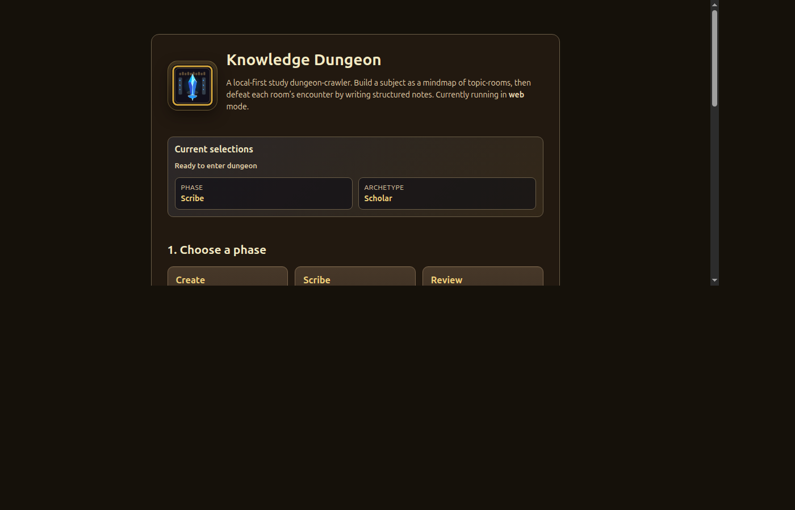

The **Current selections** card echoes the active phase and archetype, and
shows a readiness line that turns green once an archetype is selected.

---

## 2) Dungeon Village (hub world)

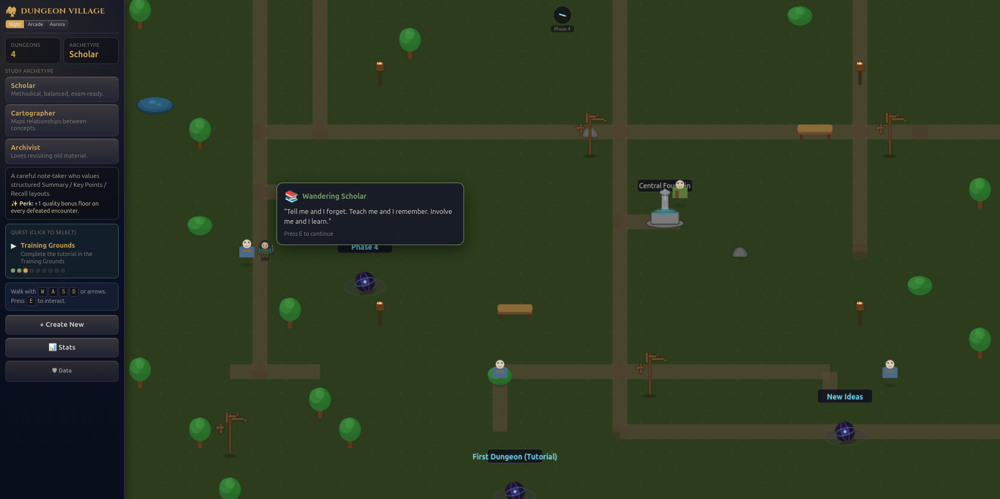

After creating a subject, the player arrives in the **Dungeon Village** - a
Phaser-rendered top-down hub world. The village replaces the direct jump from
welcome screen to dungeon, giving the player a persistent home base.

### 2a) Village layout

The village is a 36×30 tile map with a connecting stone-path road network:

- **Village Gate** (south) - entrance from the welcome screen.
- **Central Fountain** - landmark at the village center.
- **Keeper's Tower** (north) - houses the quest board and the Keeper NPC.
- **Library of Knowledge** (northwest) - in-game help panel.
- **Training Grounds** (west) - launches the tutorial dungeon.
- **Guild Hall** (northeast) - create new subjects.
- **Trophy Hall** (southeast) - view your collection.
- **Dungeon Portals** - up to 6 animated vortex icons scattered across
  the map, one per subject.

### 2b) Village HUD (fixed sidebar)

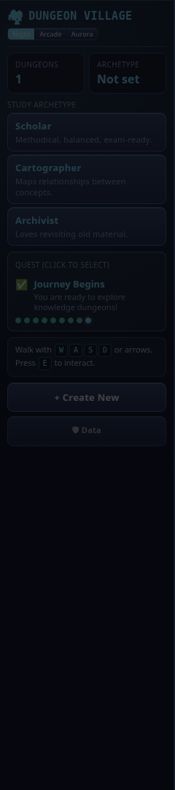

The village HUD is a **fixed left sidebar** (like the dungeon HUD) containing:

- **Header** - "Dungeon Village" title + theme picker (Night / Arcade / Aurora).
- **Stats** - dungeon count and selected archetype.
- **Archetype selector** - click a class to select it; clicking again shows
  a detail panel with the class description and perk.
- **Quest log** - shows the current quest step, hint text, and progress dots.
  Click a dot to switch quests. Click the active step to hear the Keeper's guidance.
- **Controls hint** - WASD/arrow movement and E to interact.
- **Action buttons** - "Create New Subject" and "Tutorial".

On mobile (≤768px), the HUD collapses into a **bottom drawer** with a toggle button.

### 2c) Compass

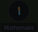

A React overlay at the top center of the village canvas points toward the
nearest portal or the Keeper's Tower. Shows the POI name when the player
is more than 2 tiles away.

### 2d) Welcome popup

On first entry to the village (per browser session), a centered modal appears:
"Welcome to the Dungeon Village! Explore the buildings, meet the Keeper, and
step through a portal to begin your studies."

### 2e) Quest board

Approach the **Keeper's Tower** or press E near it to open the quest board.
Lists all 10 quest steps with status (✅ done / ▶ active / ⬜ locked).
Click a step to hear the Keeper's guidance for that quest. Steps 7–9
(Clear a Room, Write a Note, Review Artifact) have a **Mark Complete**
button because they happen inside dungeons and can't be auto-detected.

### 2f) Signposts

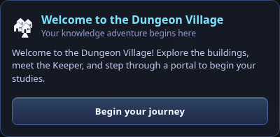

Five multi-directional signposts at key crossroads. Approach one to see
an info panel with directions (e.g. "↑ North - Keeper's Tower & Library").
The entrance signpost shows a village overview with building descriptions.

### 2g) NPCs

- **Keeper of Knowledge** - guide NPC near Keeper's Tower. Patrols the
  northern area. Context-aware dialogue based on current quest step.
- **Wandering Scholar** - patrols the central market square. Shows random
  learning quotes when approached.
- **Thoughtful Traveler** - walks the east path. Learning quotes.
- **Curious Apprentice** - near the trophy hall. Learning quotes.
- **Elder Sage** - patrols the northeast quadrant. Learning quotes.
- **Ink-Stained Scribe** - walks the south fountain area. Learning quotes.

### 2h) Trophy Hall

Approach the Trophy Hall to see a summary of your collection across all
subjects: badges earned, artifacts collected, journal entries, and
dungeon count. Data is aggregated from the per-subject progression store.

---

## 3) Main game shell (HUD + minimap + room panel)

The game shell combines several persistent UI regions, all rendered as
**floating overlays** above a full-canvas Phaser scene so the dungeon map
gets the maximum amount of screen space:

- **Top HUD (floating):** subject, room count, XP/rank, active phase, plus
  **Map**, **Teleport**, **Home**, and **Help** buttons. `Map` opens the full
  topic-graph view, `Teleport` opens a floor/room jump flow with a cooldown,
  `Home` returns to the village, `?` opens the help overlay. First-time
  users see **one-time tooltips** on Map, Teleport, and Info buttons that explain
  each feature with a "Got it" dismiss button.
- **Center gameplay canvas:** Phaser dungeon movement and interactions. The
  camera automatically zooms **in** when the player is standing inside a
  room (so the active room feels focused) and **out** when traveling along
  a corridor between rooms (so more of the map is visible). The player is drawn
  with a class-themed SVG sprite (Scholar / Cartographer / Archivist) and
  has a subtle idle breathing animation. In RPG mode, corridors between rooms are
  decorated with a stone pathway tile texture so the dungeon reads as
  connected chambers rather than a graph.
- **Minimap (bottom-left, floating):** quick room-location awareness. The
  current room and any rooms **directly connected** to it are highlighted
  in the accent color.
- **Right room panel (floating):** a quick-access **Collections** row for
  **Inventory**, **Badges**, and **Diary** keeps progression actions visible
  without crowding the HUD. The panel also includes topic metadata,
  breadcrumbs, and travel shortcuts.
- **Touch controls (bottom-right, floating):** mobile-friendly directional
  / interact buttons.

See [`CUSTOMIZATION.md`](./CUSTOMIZATION.md) for how to swap in your own
sprites and tilesets, and for where desktop subject exports are written from.

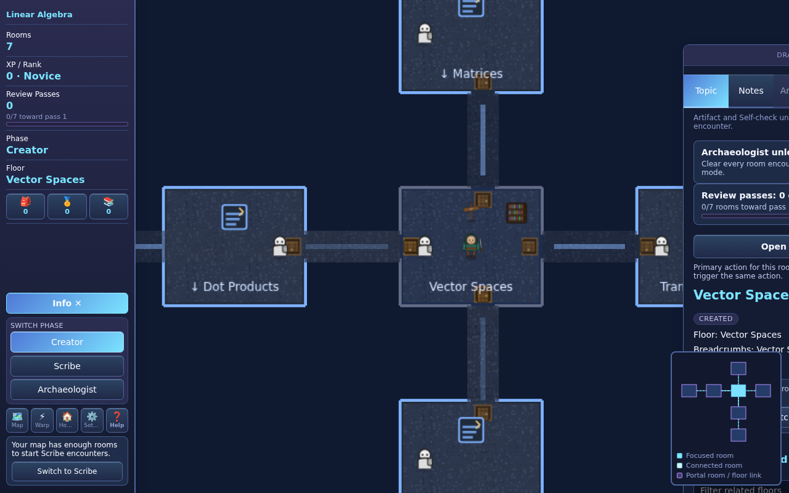

## 4) Auto-zoom (room ↔ corridor)

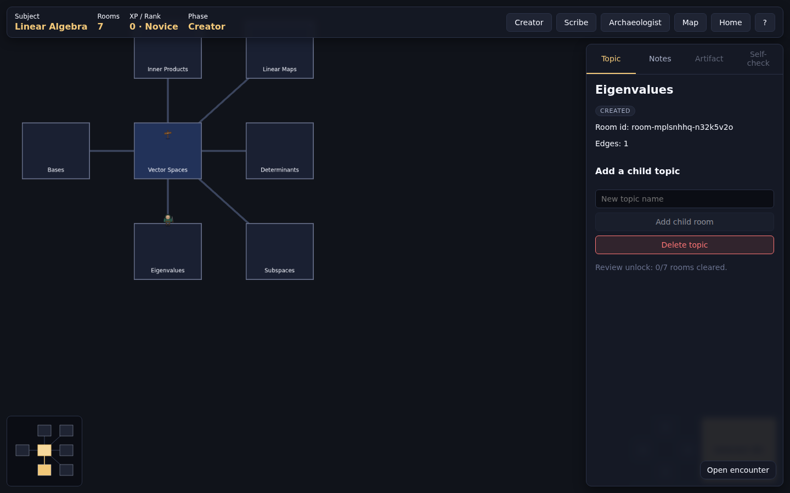

When the player steps out of a room onto a corridor, the camera smoothly
tweens to a wider zoom so more of the dungeon is visible at once. Stepping
back into a room tweens the camera back in to a tighter zoom.

## 5) Full map view

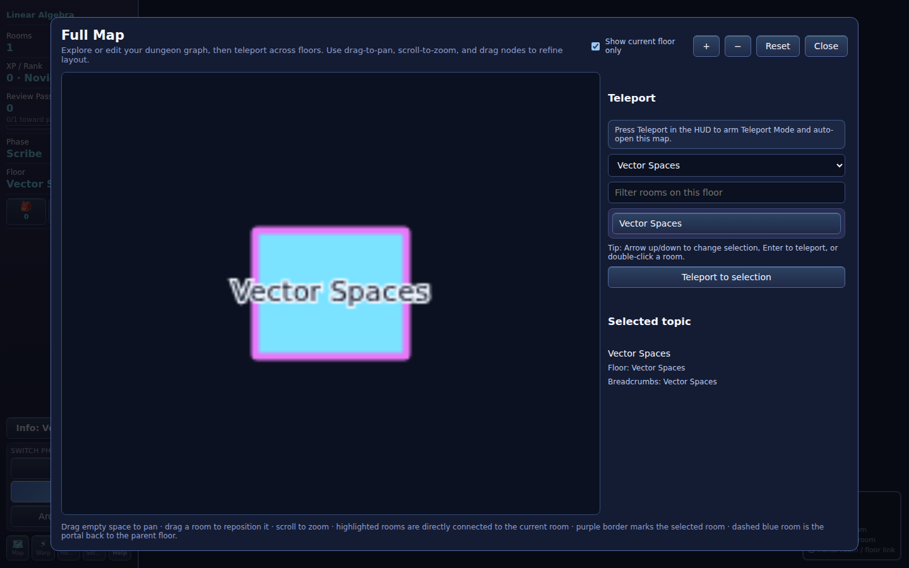

Opened from the HUD `Map` button or by pressing <kbd>M</kbd>. The full map
view renders the dungeon topic graph with **drag-to-pan** and
**scroll-to-zoom**, plus `+` / `−` / `Reset` controls. You can also drag
individual room nodes to reposition the layout.

A **Show current floor only** toggle (top of the dialog, on by default)
narrows the view to the floor you're currently on. Turn the toggle off to
inspect the whole graph at once.

In Creator phase, switch from **Navigate** to **Graph edit** mode to
rename, add, delete, or reparent topics directly from the map.

## 6) Minimap child highlighting

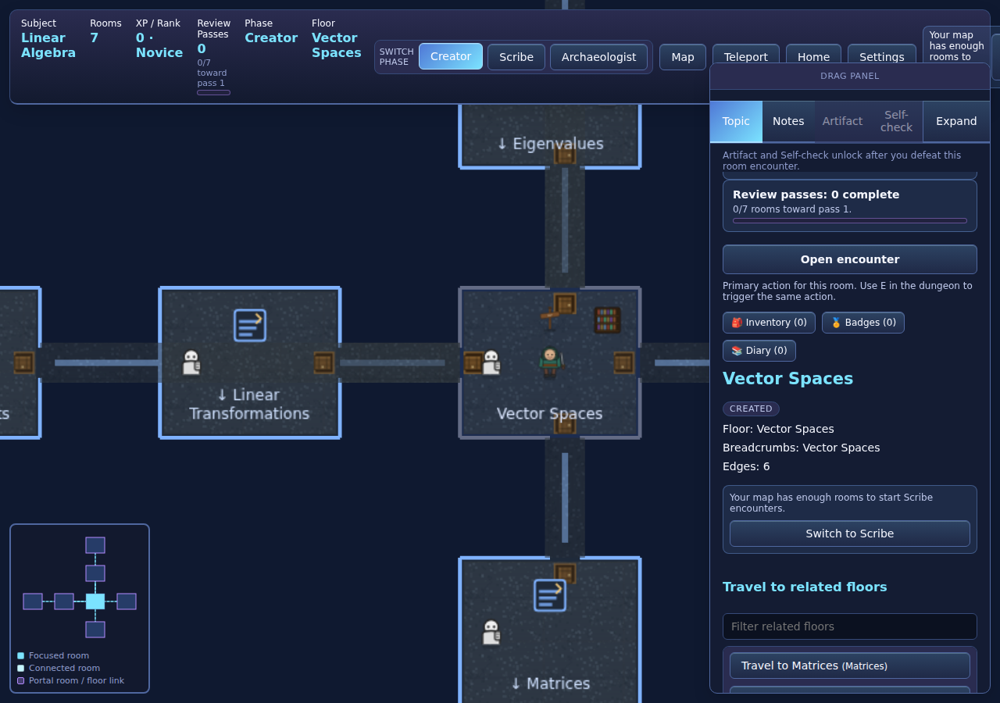

The minimap tints the currently focused room in the strong accent color,
and any rooms **directly connected** to it in a softer accent.

## 7) Creator-phase topic management (add / delete)

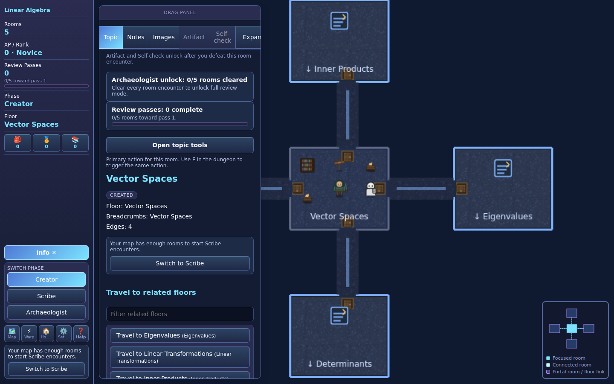

During the **Create** phase the Topic tab exposes bulk Add child topics,
Change parent, and Delete topic actions. The root topic cannot be deleted.

## 8) Help overlay

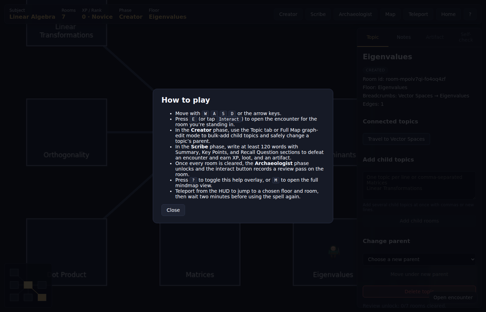

The help dialog is opened from the `?` button (or keyboard `?`) and summarizes
movement controls, map controls, collections, teleport usage, and phase differences.

## 9) Note editor modal (encounter resolution)

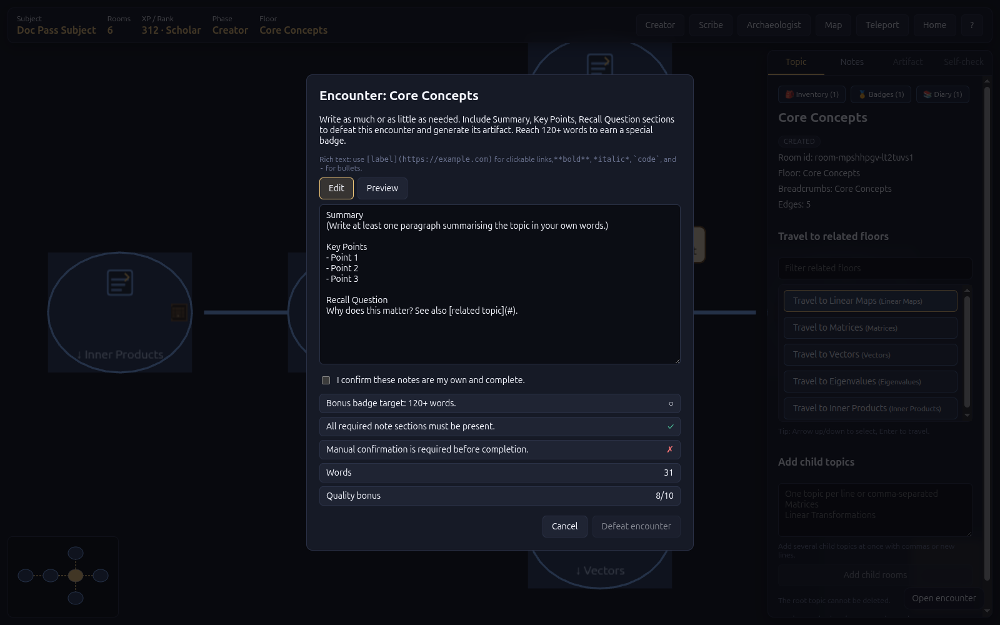

This modal appears when opening a room encounter. It provides structured notes
input, a Save draft path, Markdown support, a rubric breakdown with fix hints,
image attachment, and quality bonus preview.

## 10) Archaeologist phase loot icons

During the **Archaeologist** phase, every room that has produced an
artifact is decorated with a glowing, pulsing loot-chest sprite in the
dungeon view.

## 11) Inventory, badges, and diary panel

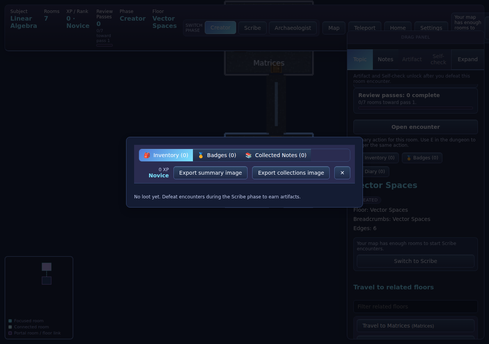

The room panel **Collections** buttons open a shared tabbed modal
that surfaces the player's progression rewards: Inventory (loot artifacts),
Badges (milestone badges as pill chips), and Diary (collected notes).

## 12) Mobile-responsive layout

Knowledge Dungeon adapts to three distinct viewport tiers.

### 12a) Desktop game screen (≥ 960 px)

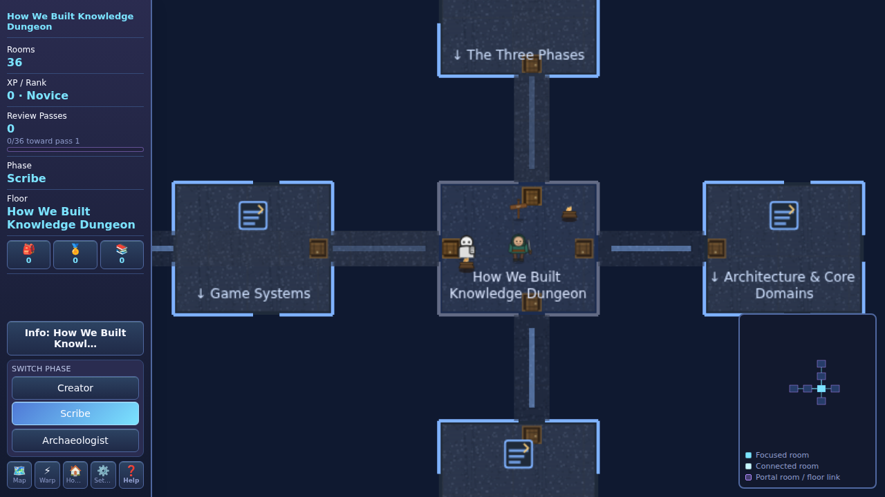

### 12b) Welcome screen - mobile (≤ 480 px)

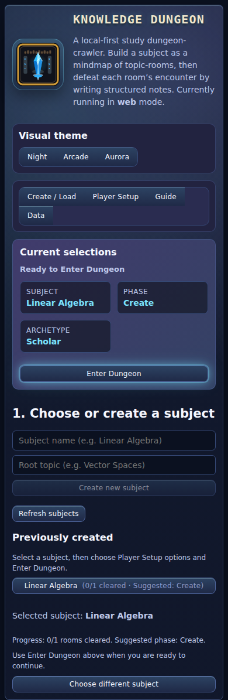

### 12c) Player Setup tab - single-column (≤ 600 px)

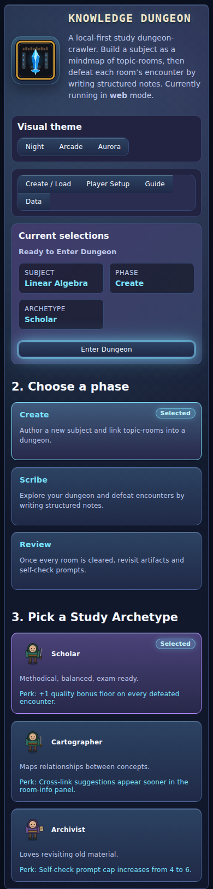

### 12d) Tablet HUD (≤ 900 px) - compact top rail

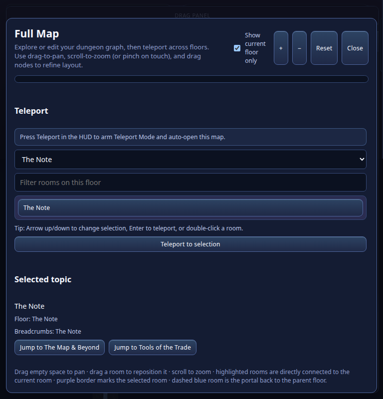

### 12e) Mobile game HUD (≤ 480 px) - stripped top rail

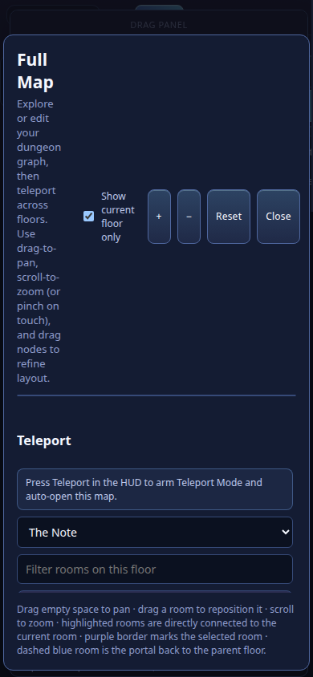

### 12f) Room panel - mobile (≤ 480 px)

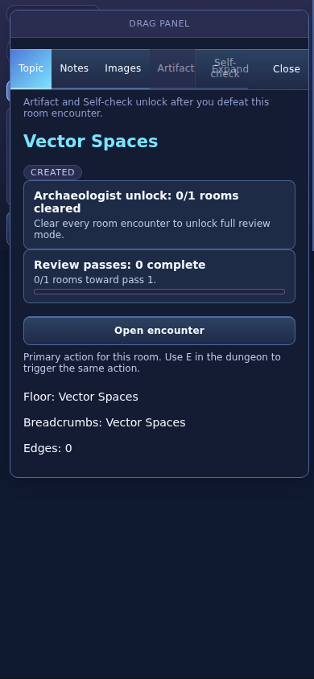

### 12g) Village HUD - mobile (≤ 768 px)

The village HUD collapses into a bottom drawer with a toggle button (☰/✕)
fixed at the top-right corner of the screen. The drawer slides up with the
full HUD content (quest log, archetype selector, stats, actions).
